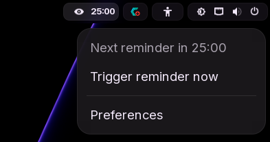
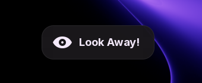
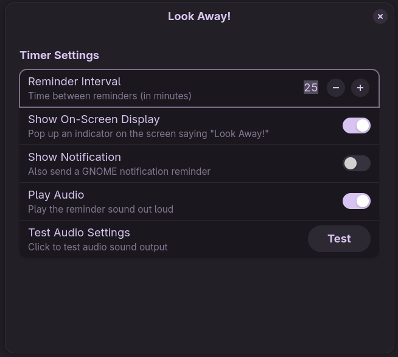

# Look Away!

A focused GNOME Shell extension that reminds you to stop staring at the screen and give your eyes a break.

It lives in the top panel, shows a clean countdown, pops an on-screen reminder when it is time to pause, and can play audio or send a notification too.

## Why This Exists

The classic `20-20-20` rule is simple:

- Every 20 minutes
- Look 20 feet away
- For 20 seconds

This extension turns that into a lightweight GNOME-native workflow instead of something you have to remember manually.

## What You Get

- Top panel status icon with countdown
- Reminder interval in minutes
- GNOME OSD reminder
- GNOME notification
- Reminder audio
- Support for GNOME Shell `45` through `50`

## Screenshots

### Status Icon

The panel indicator stays visible so you always know when the next break is coming.



### OSD Reminder

When the timer fires, the extension can show a GNOME OSD reminder directly on screen.



### Preferences

Everything important is configurable without clutter.



## Installation

### Manual Installation

From the project root:

To build, install, and then log out of GNOME:

```bash
./build.sh -bil
```
